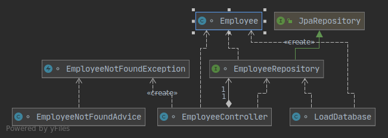

# Lab 3 Multi-layer web applications with Spring Boot

## 3.1 Layered applications in Spring

##### Return all employees in the database:

`curl --request GET http://127.0.0.1:8080/employees`

```
{"_embedded":{"employeeList":[{"id":1,"name":"Bilbo Baggins","role":"burglar","_links":{"self":{"href":"http://127.0.0.1:8080/employees/1"},"employees":{"href":"http://127.0.0.1:8080/employees"}}},{"id":2,"name":"Frodo Baggins","role":"thief","_links":{"self":{"href":"http://127.0.0.1:8080/employees/2"},"employees":{"href":"http://127.0.0.1:8080/employees"}}}]},"_links":{"self":{"href":"http://127.0.0.1:8080/employees"}}}%     
```

#### Retrieve one specific employee by specifying the id on the url http://127.0.0.1:8080/employees/{id}}:

`curl --request GET http://127.0.0.1:8080/employees/1`

```
{"id":1,"name":"Bilbo Baggins","role":"burglar","_links":{"self":{"href":"http://127.0.0.1:8080/employees/1"},"employees":{"href":"http://127.0.0.1:8080/employees"}}}
```

#### Add one user to the database:

`curl -d '{"name":"Samwise Gamgee", "role":"gardener"}' -H "Content-Type: application/json" -X POST http://127.0.0.1:8080/employees/`

```
{"id":3,"name":"Samwise Gamgee","role":"gardener"}
```

Result of the GET:

```
{"_embedded":{"employeeList":[{"id":1,"name":"Bilbo Baggins","role":"burglar","_links":{"self":{"href":"http://127.0.0.1:8080/employees/1"},"employees":{"href":"http://127.0.0.1:8080/employees"}}},{"id":2,"name":"Frodo Baggins","role":"thief","_links":{"self":{"href":"http://127.0.0.1:8080/employees/2"},"employees":{"href":"http://127.0.0.1:8080/employees"}}},{"id":3,"name":"Samwise Gamgee","role":"gardener","_links":{"self":{"href":"http://127.0.0.1:8080/employees/3"},"employees":{"href":"http://127.0.0.1:8080/employees"}}}]},"_links":{"self":{"href":"http://127.0.0.1:8080/employees"}}}
```


#### Update one user to the database by specifying the id on the url http://127.0.0.1:8080/employees/{id} of the user to update:

`curl -d '{"name":"Samwise Gamgee", "role":"Coordinator"}' -H "Content-Type: application/json" -X PUT http://127.0.0.1:8080/employees/3`

Result of the GET:

```
{"_embedded":{"employeeList":[{"id":1,"name":"Bilbo Baggins","role":"burglar","_links":{"self":{"href":"http://127.0.0.1:8080/employees/1"},"employees":{"href":"http://127.0.0.1:8080/employees"}}},{"id":2,"name":"Frodo Baggins","role":"thief","_links":{"self":{"href":"http://127.0.0.1:8080/employees/2"},"employees":{"href":"http://127.0.0.1:8080/employees"}}},{"id":3,"name":"Samwise Gamgee","role":"Coordinator","_links":{"self":{"href":"http://127.0.0.1:8080/employees/3"},"employees":{"href":"http://127.0.0.1:8080/employees"}}}]},"_links":{"self":{"href":"http://127.0.0.1:8080/employees"}}}
```


#### Delete one user of the database by specifying the id on the url http://127.0.0.1:8080/employees/{id} of the user to delete::

`curl --request DELETE http://127.0.0.1:8080/employees/3`

Result of the GET:

```
{"_embedded":{"employeeList":[{"id":1,"name":"Bilbo Baggins","role":"burglar","_links":{"self":{"href":"http://127.0.0.1:8080/employees/1"},"employees":{"href":"http://127.0.0.1:8080/employees"}}},{"id":2,"name":"Frodo Baggins","role":"thief","_links":{"self":{"href":"http://127.0.0.1:8080/employees/2"},"employees":{"href":"http://127.0.0.1:8080/employees"}}}]},"_links":{"self":{"href":"http://127.0.0.1:8080/employees"}}}
```


### c) What happens to your data when the application is stopped and restarted? How could you change that behavior?

The changes that were made to the database are gone and it restarts the database with the same initial data.

One way to solve is to save the data to a file everytime an operation is made to alter it, other way could be using an online database, and another way could be decoupling te database from the rest api so that when the rest is down, the database continues running with the data.



The EmployeeRepository stores all data used by the program and allows the management of this data, like the operations made earlier, GET, PUT, UPDATE, DELETE...

The Controller handles the HTTP Requests and does the mapping to the right operation on the Repository returning the requested operation result.

The employee is an entity that represents the data to be stored, being object ready for storage in the JpaRepository.

## **3.2 Accessing JPA Data with REST interface**

The Java Persistence API (JPA) defines a standard interface to manage data over relational databases. Most of the work is provided by the adaption layer that implements the JPA specification and converts objects into relational data and vice-versa. A common implementation is the Hibernate framework. Spring Data uses and enhances the JPA.

When you use JPA, your Java code is independent from the specific database implementation.

### POST requests

#### Add a new employee to the database:

##### `curl -X POST -d '{"firstName":"Chico","lastName":"Silva","emailId":"chico@ua.pt"}' -H "Content-Type: application/json" http://localhost:8080/api/v1/employees`

#### 	Result:

`{"id":1,"firstName":"Chico","lastName":"Silva","emailId":"chico@ua.pt"}`

### GET requests

#### Get a list of all the employees:

##### `curl http://localhost:8080/api/v1/employees`

#### 	Result:

`[{"id":1,"firstName":"Chico","lastName":"Silva","emailId":"chico@ua.pt"},{"id":2,"firstName":"Antonio","lastName":"Costa","emailId":"ant@ua.pt"}`]

#### Get a specific employee by indicating the {id} in the url:

##### `curl http://localhost:8080/api/v1/employees/2`

​	Result:

`{"id":2,"firstName":"Antonio","lastName":"Costa","emailId":"ant@ua.pt"}`

### PUT requests

#### Update information about a specific employee by indicating the {id} in the url:

##### `curl -X PUT -d '{"firstName":"Chico","lastName":"Silva","emailId":"random@ua.pt"}' -H "Content-Type: application/json" http://localhost:8080/api/v1/employees/1`

#### 	Result:

`{"id":1,"firstName":"Chico","lastName":"Silva","emailId":"random@ua.pt"}`

### DELETE requests

#### Delete a specific employee by indicating the {id} in the url:

##### `curl -X DELETE http://localhost:8080/api/v1/employees/1`

#### 	Result:

`{"deleted":true}`


#### Explain the annotations `@Table`, `@Column`, `@Id` found in the Employee entity.

##### @Table: 

​	It allows to specify the details of the table that is going to be used to stored all the data in the database.

##### @Column: 

​	Used to associate the column of the table with a specific field (we can specifiy the name of table, if it can be null, empty, etc).

##### @Id: 

​	Used to specify some field as the primary key.


#### Explain the use of the annotation `@AutoWired`

If we annotate a class with `@Autowired`, Spring will automatically resolve the instance and inject it into the class that declared it. So, we don’t need to obtain the singleton instance ourselves. The annotation can be used directly on **properties**, therefore eliminating the need for getters and setters.

Example:

```
@Autowired  
private EmployeeRepository employeeRepository;
```

@AutoWIred annotation is eliminating the need to manually use getters and setters. SpringBoot will look for and inject *employeeRepository* during the creation of the EmployeeController doing all the work.


#### Explain the differences between the RestController and Controller components used in this sample.

The **@RestController** annotation in Spring MVC is nothing but a combination of @Controller and @ResponseBody annotation. It was added into Spring 4.0 to make the development of RESTful Web Services in Spring framework easier.

The job of @Controller is to create a Map of the model object and find a view but @RestController simply returns the object and object data is directly written into HTTP response as JSON or XML. This can also be done with traditional @Controller and use @ResponseBody annotation but since this is the default behavior of RESTful Web services, Spring introduced @RestController which combined the behavior of @Controller and @ResponseBody together.

#### Both the RestControllerand the Controller need to access the database, using a Repository. How do they get a valid instance of the Repository to work with?

​    There are two ways to get the database instance:

```
@AutoWired

Repository repository;
```

```
private Repository repository;

public IssueRestController(Repository repository) { 

		this.repository = repository;

}
```

The first one spring boot after seeing the @AutoWired annotation will look for an instance of the repository and assign it to the repository variable.

The second one spring boot when trying to instatiate the Controller class will look for an instance of the repository and assing to the repository variable.